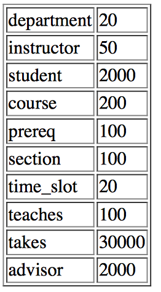

# BigUniversityRDB

The `BigUniversityRDB` repository contains SQL DDL, DML, and supporting documentation for the __University Database Schema__ presented by Silberschatz et al in __Database System Concepts (6th edition)__ McGraw Hill, 2010.

To understand the scope and semantics of these scripts, make sure to first see the contents of the [SmallUniversityRDB Github repository](https://github.com/Yeshiva-University-CS/SmallUniversityRDB).

## Contents

* `DDL.sql`: invoke this script when creating the database tables for the first time
* `DDLAndDrop.sql`: invoke this script use this if you wish to recreate the database after dropping existing tables.
* `populateLargeTables.sql`: populates the database tables.

## Database Tables

Per the authors: "The file largeRelationsInsertFile.sql contains SQL insert statements for larger, randomly created relations for a truly strange university (since course titles and department names are chosen randomly)."

The size of the "large' database tables are shown below.

 

## Script Execution

The authors claim that these scripts should run for "most databases other than MySQL".  I have tried them only for _PostgreSQL 11_, but see no reason why they can't run successfully on "most other databases".

With Postgres, you can invoke a script thusly:

> psql -f file.sql

